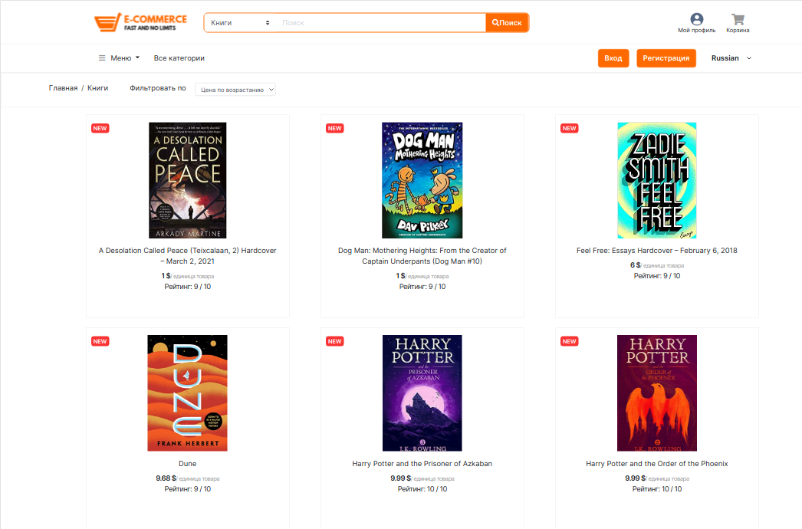

# [e-commerce](https://e-commerce-here.herokuapp.com) || Интернет-магазин

## Запуск: в папках server/src, client/src
```bash
npm i
npm start
```
<p align="center">
  
   
</p>

## Функционал

• регистрация и аутентификация польтзователей на JWT,

• разграничение доступов к материалам сайта на основе ролей - продавца и покупателя,

• продавец: реализовано добавление товаров для продажи, личный кабинет с аналитикой по продажам, список товаров для реализации,

• покупатель: личный кабинет с возможностью добавить товар в корзину и оформить заказ на сайте, список прошлых заказов,

• интеграция с платежной системой Pay Pal,

• интеграция с внешними API (dadata), использование библиотек для визуализации данных (d3, vis),

• реализован поиск по сайту и сортировка товаров внутри категорий,

• интеграция с Facebook Chat.

<p align="center">
  
</p>

<p align="center">

</p>

## Планы 

1) Добавление показа товаров в режиме online c использованием веб-сокетов
2) Реализовать добавление товаров в wishlist для покупателя
3) Разработка мобильного приложения на React Native
